# Photo to Print Poem

把普通照片转换成暖白纸张、大面积留白、有限色板和手工印刷颗粒感的极简诗意版画。

[](https://github.com/KenView/photo-to-print-poem/releases/latest)
[](LICENSE)

适合人像、街景、风景、水面、建筑和静物。Skill 会尽量保留原图的主体、姿态、透视与关键视觉锚点，并按用户要求控制留白、强调色、画幅和诗意短句。

## 一分钟安装

### 方法一：下载 Release ZIP（推荐）

1. 下载最新版 [`photo-to-print-poem.zip`](https://github.com/KenView/photo-to-print-poem/releases/latest/download/photo-to-print-poem.zip)。
2. 解压后取得 `photo-to-print-poem` 文件夹。
3. 将整个文件夹复制到 Codex Skills 目录：
   - 设置了 `CODEX_HOME`：`$CODEX_HOME/skills/`
   - 未设置 `CODEX_HOME`：`~/.codex/skills/`
4. 确认最终结构不是重复嵌套：

```text
~/.codex/skills/
└── photo-to-print-poem/
    ├── SKILL.md
    ├── agents/
    │   └── openai.yaml
    └── assets/
        └── icon.svg
```

5. 如果当前 Codex 会话未识别到新 Skill，请重新打开一个任务或重启 Codex。

### Windows PowerShell

在仓库根目录或解压目录中运行：

```powershell
$codexSkills = if ($env:CODEX_HOME) {
  Join-Path $env:CODEX_HOME "skills"
} else {
  Join-Path $HOME ".codex\skills"
}

New-Item -ItemType Directory -Force -Path $codexSkills | Out-Null
Copy-Item -Recurse -Force ".\photo-to-print-poem" $codexSkills
Test-Path (Join-Path $codexSkills "photo-to-print-poem\SKILL.md")
```

最后一行返回 `True` 即表示文件位置正确。

### macOS / Linux

在仓库根目录或解压目录中运行：

```bash
codex_skills="${CODEX_HOME:-$HOME/.codex}/skills"
mkdir -p "$codex_skills"
cp -R ./photo-to-print-poem "$codex_skills/"
test -f "$codex_skills/photo-to-print-poem/SKILL.md" && echo "installed"
```

### 直接从 GitHub 克隆

```bash
git clone --depth 1 https://github.com/KenView/photo-to-print-poem.git
cd photo-to-print-poem
```

然后按照上面的 Windows 或 macOS/Linux 命令，只复制仓库中的 `photo-to-print-poem/` 子文件夹，不要把整个仓库复制到 Skills 目录。

## 使用方法

上传一张照片，然后直接说：

```text
使用 $photo-to-print-poem 把这张照片做成诗意版画。
```

更具体的示例：

```text
使用 $photo-to-print-poem 处理这张图。保留人物姿势和红色外套，留白更多，不要文字，输出 3:4。
```

```text
使用 $photo-to-print-poem 把这张街景做成旧杂志版画。保留红色出租车，其他颜色压低，底部加一句很短的英文。
```

```text
使用 $photo-to-print-poem。第一张是要处理的照片，第二、三张只作为配色和纸张质感参考，不要把参考图中的人物或场景复制进结果。
```

### 常用参数

| 你可以这样说 | 效果 |
| --- | --- |
| `留白更多` | 缩小主体并增加呼吸区，同时保持识别度 |
| `不要文字` / `不要自动文案` | 完全移除文字 |
| `用中文` | 使用 6–18 个汉字的短句 |
| `人物更像原图` | 加强身份、脸型、发型、姿态和服装轮廓保持 |
| `更像版画` | 增强颗粒、缺墨和块面感 |
| `更像水彩` | 减少硬块面，增加轻淡水洗 |
| `保留红色，其他压低` | 将指定颜色作为唯一或主要强调色 |
| `1:1` / `9:16` / `保持原比例` | 覆盖默认 3:4 画幅 |
| `只要提示词` | 不生成图片，只返回结构化提示词 |

### 多张图片怎么提供

- 一张目标照片加风格参考图：明确说“第一张是目标图，其余只作风格参考”。
- 多张目标照片批量处理：明确说“每张单独生成，不要混合场景”。
- 多张图片但角色不明确：Skill 会先询问，不会擅自混合或批量生成。

## 6 组原图 / 使用 Skill 后 Demo

所有原图均来自许可信息明确的公共领域摄影作品；效果图使用本 Skill 的实际工作流生成。

### Demo 1：人像——身份、侧脸与帽子轮廓

提示：`保留人物帽子、侧脸、卷发和肩部轮廓，留白更多，不要文字。`

<table><tr><th>原图</th><th>使用 Skill 后</th></tr><tr><td>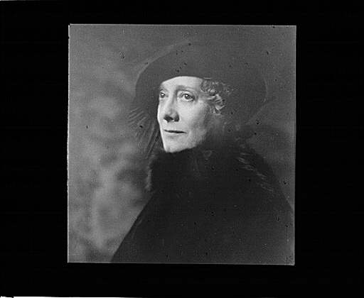</td><td>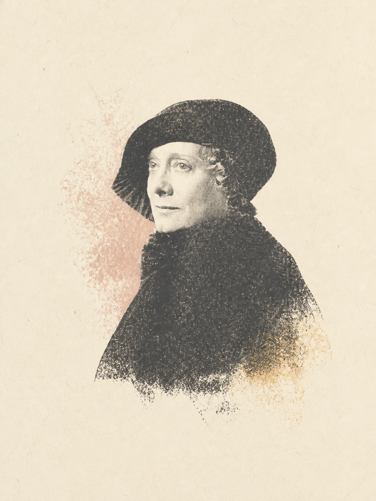</td></tr></table>

### Demo 2：街景——复杂人群、透视与精确英文

提示：`保留左侧路灯、中央人群和建筑透视，使用砖红强调色，加小字 “the city moves in soft ink.”。`

<table><tr><th>原图</th><th>使用 Skill 后</th></tr><tr><td>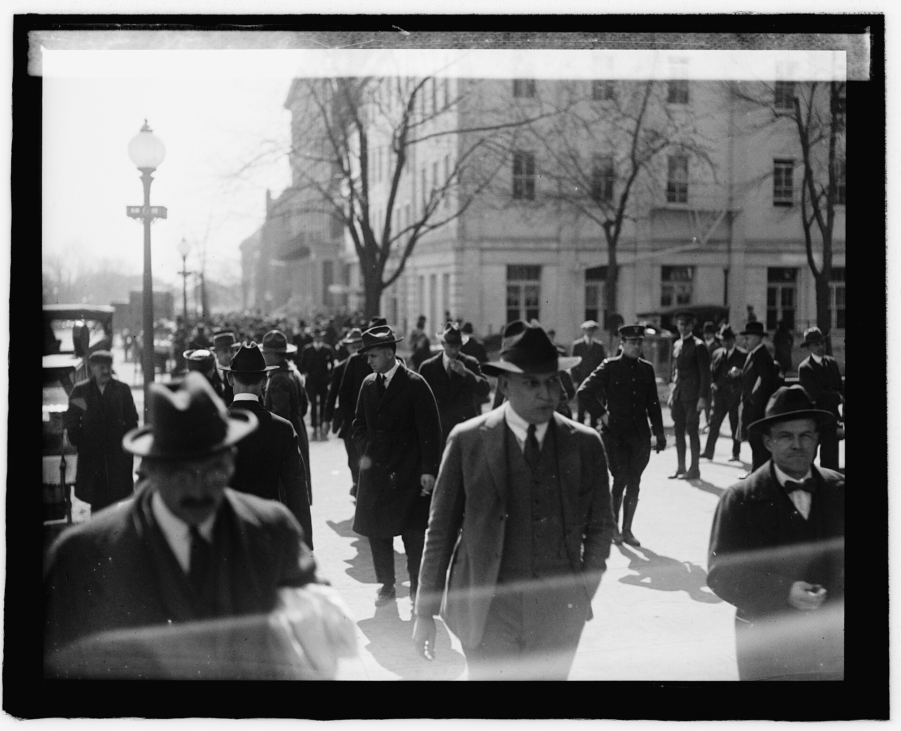</td><td>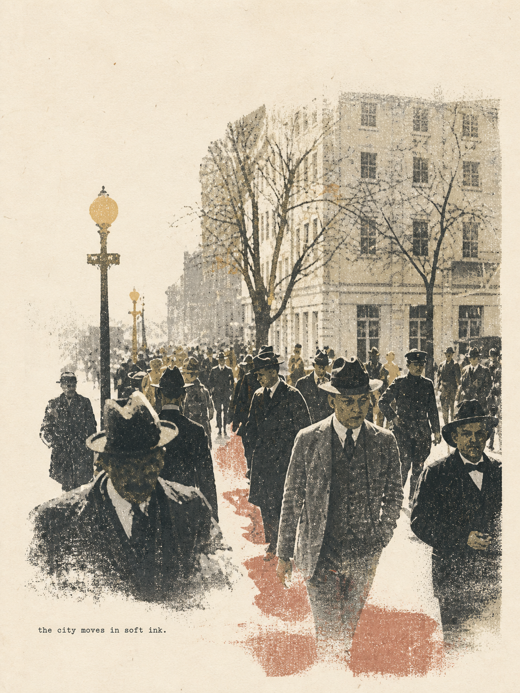</td></tr></table>

### Demo 3：山湖——大结构、蓝灰强调色与留白

提示：`保留湖面、V 形山谷、山峰、远岸松树和前景石块，不要文字。`

<table><tr><th>原图</th><th>使用 Skill 后</th></tr><tr><td>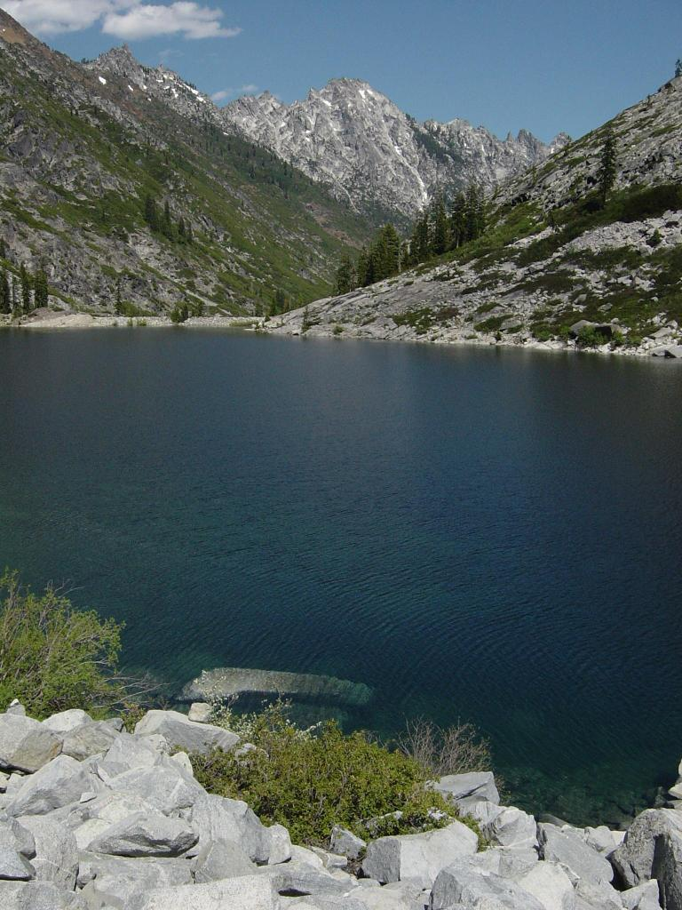</td><td>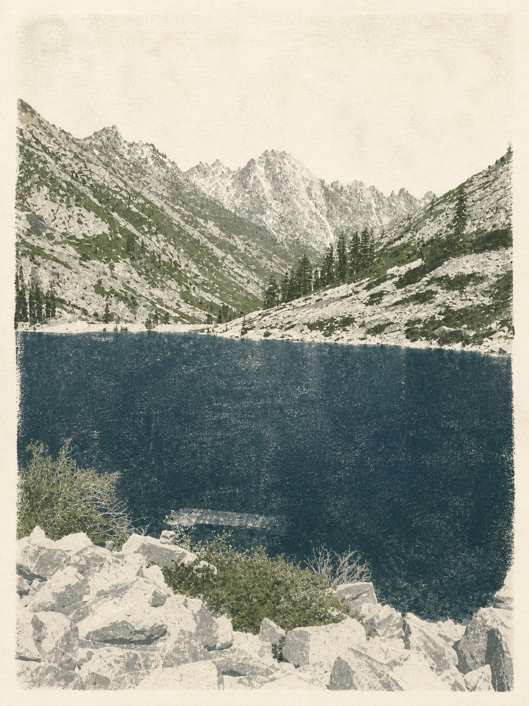</td></tr></table>

### Demo 4：静物——红黄强调色与器物轮廓

提示：`保留铜色滤篮、红色油桃和黄色香蕉，其他细节简化，留白更多，不要文字。`

<table><tr><th>原图</th><th>使用 Skill 后</th></tr><tr><td>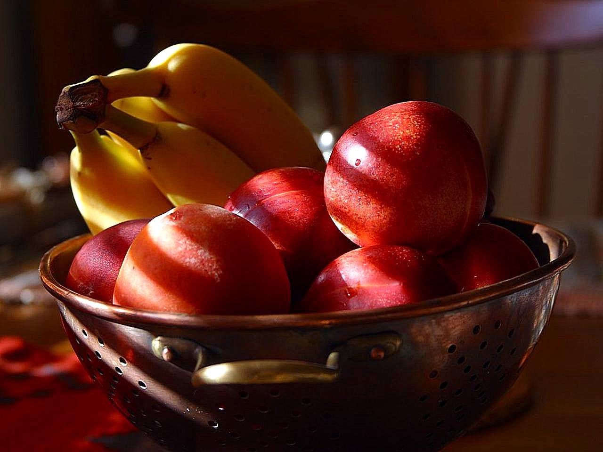</td><td>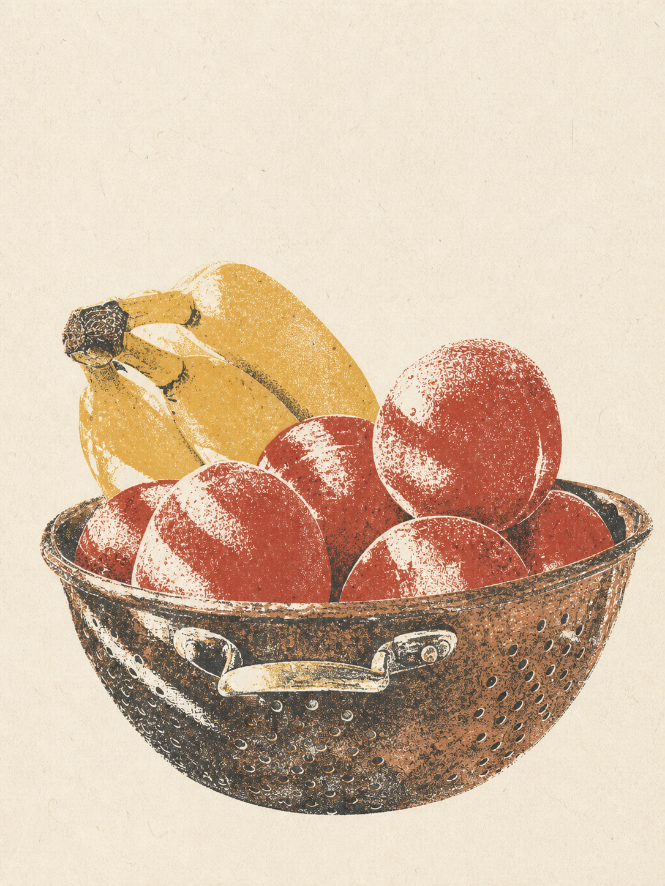</td></tr></table>

### Demo 5：建筑——雕花简化与中文短句

提示：`保留双开木门、四块雕花面板和圆窗，底部加小字“门外，风很轻。”。`

<table><tr><th>原图</th><th>使用 Skill 后</th></tr><tr><td>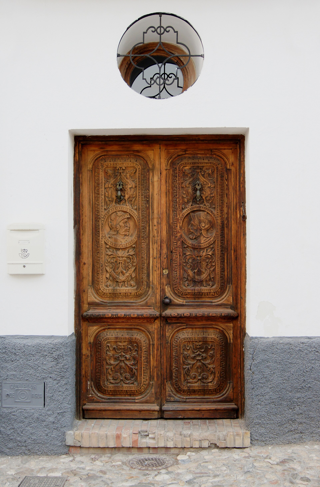</td><td>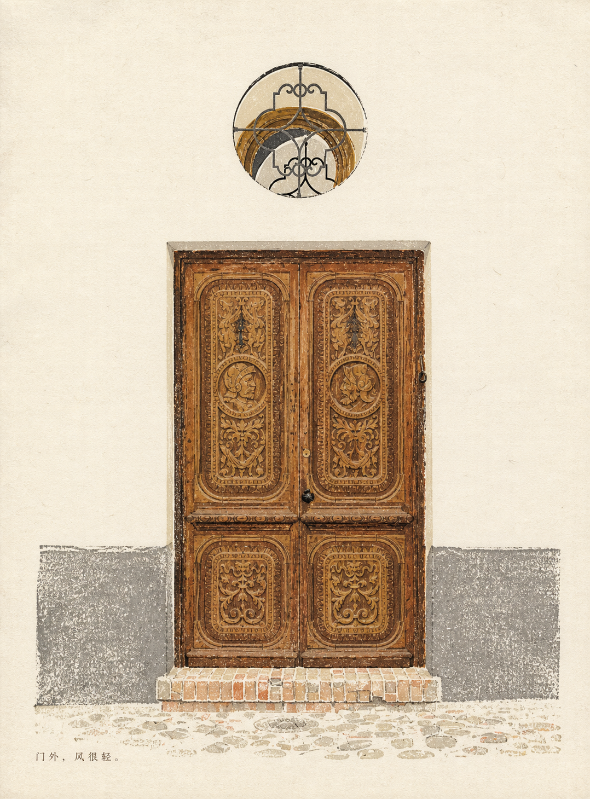</td></tr></table>

### Demo 6：船景——主体几何、水面倒影与雾山层次

提示：`保留船体、驾驶舱、栏杆、倒影和远山，清除船身文字，不要文案。`

<table><tr><th>原图</th><th>使用 Skill 后</th></tr><tr><td>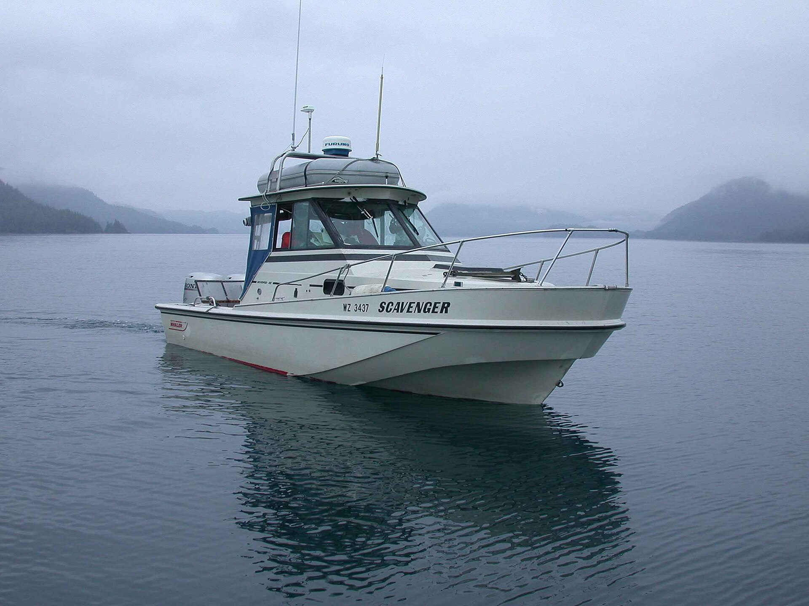</td><td>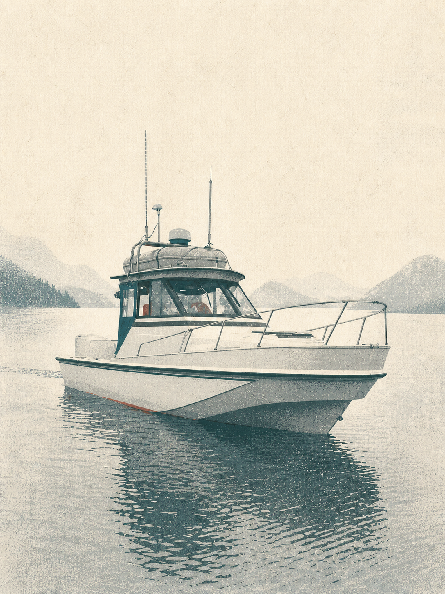</td></tr></table>

## 测试与质量状态

- 官方 `quick_validate.py`：通过
- `agents/openai.yaml` YAML 解析：通过
- SVG 图标解析：通过
- 6 组原图/效果图视觉测试：通过
- 目标图与风格参考图角色隔离测试：通过
- 英文和中文短句准确性测试：通过
- 船景首次出现伪文字，按 Skill 规则仅做一次定向修正后通过

完整记录、素材来源与验收标准见 [`tests/TEST_REPORT.md`](tests/TEST_REPORT.md)。

## 更新

使用 Release ZIP 安装时，下载新版本并用新的 `photo-to-print-poem` 文件夹覆盖旧文件夹。

使用 Git 克隆时：

```bash
git pull
```

然后重新复制 `photo-to-print-poem/` 子文件夹到 Codex Skills 目录。

## 常见问题

### Codex 没有识别到 Skill

检查是否存在：

```text
~/.codex/skills/photo-to-print-poem/SKILL.md
```

最常见问题是多套了一层目录，例如 `photo-to-print-poem/photo-to-print-poem/SKILL.md`。修正后重新打开任务或重启 Codex。

### 只返回了提示词，没有生成图片

明确说：

```text
请直接调用可用的图像生成或编辑工具，输出最终图片，不要只返回提示词。
```

实际生成仍取决于当前 Codex 环境是否提供图像生成/编辑能力。

### 多图时人物或场景被混合

逐张标注角色，例如：

```text
Image 1 是唯一目标照片；Image 2 只参考配色；Image 3 只参考纸张颗粒。不要复制 Image 2 和 Image 3 的人物、物件或场景。
```

### 图片中的文字不准确

把文案放在引号中，要求逐字呈现；如果文字不是必要元素，建议直接使用“不要文字”，通常更稳定。

## 仓库结构

```text
photo-to-print-poem-project/
├── photo-to-print-poem/       # 可安装 Skill
│   ├── SKILL.md
│   ├── agents/openai.yaml
│   └── assets/icon.svg
├── tests/
│   ├── source-images/         # 6 张公共领域原图
│   ├── results/               # 6 张主 Demo + 角色隔离结果
│   └── TEST_REPORT.md
├── LICENSE
└── README.md
```

## 许可

Skill 代码与说明采用 [MIT License](LICENSE)。`tests/source-images/` 中的摄影作品均为公共领域；具体作者和来源见测试报告。生成结果作为测试展示提供。

> OpenAI 的 Skills API 支持上传 Skill 目录或 ZIP，但它与本地 Codex Skills 目录安装是不同流程。API 使用者请以 [OpenAI Skills API 文档](https://developers.openai.com/api/reference/python/resources/skills/methods/create)为准。
