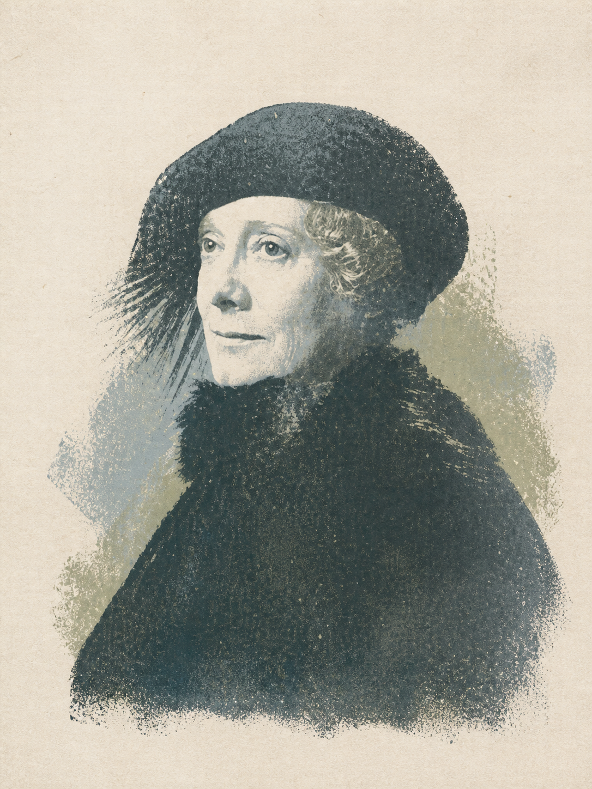

# Photo to Print Poem

一个将照片转换为暖白纸张、有限色板、手工颗粒和大面积留白风格的 Codex Skill。

## 安装

将 `photo-to-print-poem` 文件夹复制到 Codex Skills 目录，或通过支持 GitHub 路径的 Skill 安装方式安装该子目录。

## 使用示例

上传一张照片并输入：

```text
使用 $photo-to-print-poem 把这张照片做成留白感强的诗意版画。
```

也可以指定关键约束：

```text
保留人物姿势和红色外套，其他颜色压低，不要文字，输出 3:4。
```

如果同时提供目标照片和风格参考图，请明确说明每张图片的角色；Skill 在角色不明确时会先询问，而不会擅自批量生成或混合场景。

## 目录

- `photo-to-print-poem/`：可安装的 Skill。
- `tests/`：公开素材来源、测试提示和结果记录。

## 默认视觉特征

- 暖白纸张与明显留白
- Risograph / monoprint / screenprint 颗粒
- 3–6 色低饱和色板
- 保留照片主体、姿势、透视和少量视觉锚点
- 可按需添加克制的小字号短句

## 验证状态

- 官方 `quick_validate.py`：通过
- `agents/openai.yaml` YAML 解析：通过
- 人像、街景、风景真实图片转换：通过
- 多图目标/风格参考角色隔离：通过

完整素材来源、测试条件和结果见 [`tests/TEST_REPORT.md`](tests/TEST_REPORT.md)。

## 测试预览

| 人像 | 街景 |
| --- | --- |
|  |  |

| 风景 | 多图角色隔离 |
| --- | --- |
|  |  |
